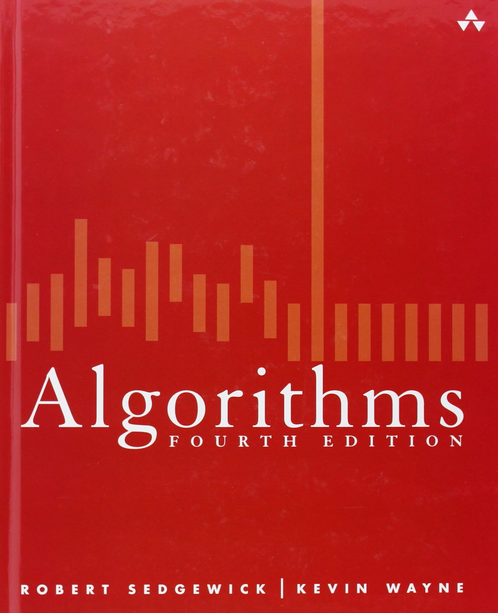

# Algo 4th

## 1 Fundamentals. . . . . . . . . . . . . . . . . . . . . .3
* 1.1 Basic Programming Model 8
* 1.2 Data Abstraction 64
* 1.3 Bags, Queues, and Stacks 120
* 1.4 Analysis of Algorithms 172
* 1.5 Case Study: Union-Find 216

