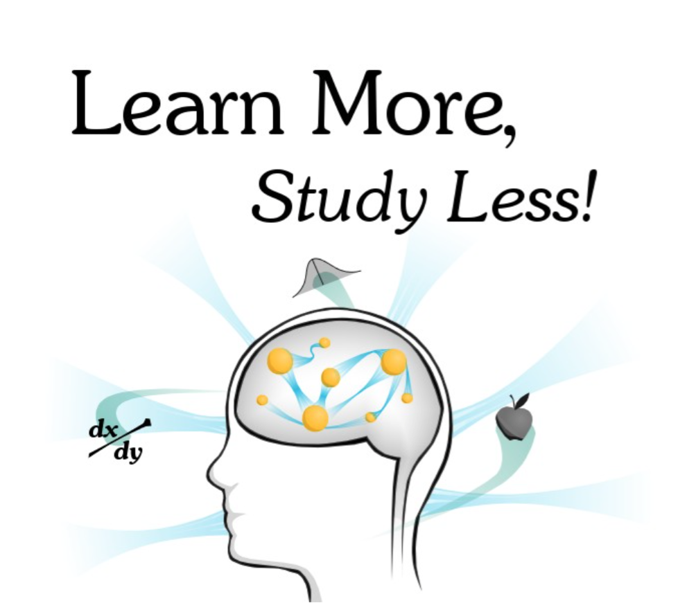

# Learn More Study Less

## Part I: The Holistic Learning Strategy 17

* Constructs
* Models
* Highways
* The Sequence of Holistic Learning 37
	* Acquire
	* Understand   
	* Explore
	* Debug
	* Apply
	* Test
	* Pinpointing Your Weaknesses in the Sequence

* Information Structures 70 

	* Arbitrary
	* Opinion
	* Process
	* Concrete
	* Abstract
	* How to Use the Five Categories

* Why Your Classes Are Boring 
* Goals for Learning