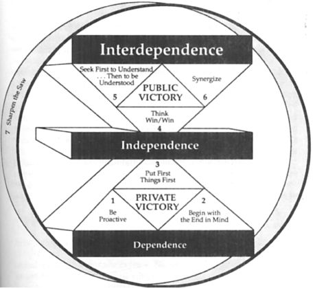

<!-- TOC depthFrom:1 depthTo:6 withLinks:1 updateOnSave:1 orderedList:0 -->

- [The 7 Habits of Highly Effective People - Stephen R. Covey](#the-7-habits-of-highly-effective-people-stephen-r-covey)
		- [PRIVATE VICTORY](#private-victory)
	- [Habit 1: Be Proactive：Personal `Vision`](#habit-1-be-proactivepersonal-vision)
	- [Habit 2: Begin with the End in Mind： personal `Leadership`](#habit-2-begin-with-the-end-in-mind-personal-leadership)
	- [HABIT 3          Put First Things First : Personal `Management`](#habit-3-put-first-things-first-personal-management)
				- [Habit 1 says, “You’re the creator. You are in charge.”](#habit-1-says-youre-the-creator-you-are-in-charge)
				- [Habit 2 is the first or mental creation.](#habit-2-is-the-first-or-mental-creation)
				- [Habit 3, then, is the second creation, the physical creation.](#habit-3-then-is-the-second-creation-the-physical-creation)

<!-- /TOC -->

# The 7 Habits of Highly Effective People - Stephen R. Covey

> Our character is a collection of our habits, and habits have a powerful role in our lives. Habits consist of knowledge, skill, and desire. Knowledge allows us to know what to do, skill gives us the ability to know how to do it, and desire is the motivation to do it.

The Seven Habits move us through the following stages:

* Dependence: the paradigm under which we are born, relying upon others to take care of us.
* Independence: the paradigm under which we can make our own decisions and take care of ourselves.
* Interdependence: the paradigm under which we cooperate to achieve something that cannot be achieved independently.


> Much of the success literature today tends to value independence, encouraging people to become liberated and do their own thing.
The reality is that we are interdependent, and the independent model is not optimal for use in an interdependent environment that requires leaders and team players.



To make the choice to become interdependent, one first must be independent, since dependent people have not yet developed the character for interdependence. Therefore, the first three habits focus on self-mastery, that is, achieving the private victories required to move from dependence to independence. The first three habits are:

* Habit 1: Be Proactive
* Habit 2: Begin with the End in Mind
* Habit 3: Put First Things First


Habits 4, 5, and 6 then address interdependence:

* Habit 4: Think Win/Win
* Habit 5: Seek First to Understand, Then to Be Understood
* Habit 6: Synergize

Finally, the seventh habit is one of renewal and continual improvement, that is, of building one’s personal production capability. To be effective, one must find the proper balance between actually producing and improving one’s capability to produce.


###      PRIVATE VICTORY

- HABIT 1          Be Proactive : Principles of Personal `Vision`
	> I know of no more encouraging fact than the unquestionable ability of man to elevate his life by conscious endeavor. - HENRY DAVID THOREAU


- HABIT 2          Begin with the End in Mind : Principles of personal `Leadership`
 	> What lies behind us and what lies before us are tiny matters. compared to what lies within us. - OLIVER WENDELL HOLMES


- HABIT 3          Put First Things First : Principles of Personal `Management`


## Habit 1: Be Proactive：Personal `Vision`

- Proactive people focus their efforts in the Circle of Influence. They work on the things they can do something about. The nature of their energy is positive, enlarging and magnifying, causing their Circle of Influence to increase.

- As long as we are working in our Circle of Concern, we empower the things within it to control us. We aren’t taking the proactive initiative necessary to effect positive change.


## Habit 2: Begin with the End in Mind： personal `Leadership`

- Principles don’t react to anything. They don’t get mad and treat us differently.

- Principles are deep, fundamental truths, classic truths, generic common denominators. They are tightly interwoven threads running with exactness, consistency, beauty, and strength through the fabric of life.

- We are free to choose our actions, based on our knowledge of correct principles, but we are not free to choose the consequences of those actions. Remember, “If you pick up one end of the stick, you pick up the other.”

- Principles always have natural consequences attached to them. There are positive consequences when we live in harmony with the principles. There are negative consequences when we ignore them. But because these principles apply to everyone, whether or not they are aware, this limitation is universal. And the more we know of correct principles, the greater is our personal freedom to act wisely.


***

- Now, in the early stages—when a person is new to an organization or when a child in the family is young—you can pretty well give them a goal and they’ll buy it, particularly if the relationship, orientation, and training are good.

- But when people become more mature and their own lives take on a separate meaning, they want involvement, significant involvement. And if they don’t have that involvement, they don’t buy it. Then you have a significant motivational problem which cannot be solved at the same level of thinking that created it.”


## HABIT 3          Put First Things First : Personal `Management`


##### Habit 1 says, “You’re the creator. You are in charge.”

It’s based on the four unique human endowments of imagination, conscience, independent will, and, particularly, self-awarness. It empowers you to say, “That’s an unhealthy program I’ve been given from my childhood, from my social mirror. I don’t like that ineffective script. I can change.”

##### Habit 2 is the first or mental creation.
It’s based on imagination—the ability to envision, to see the potential, to create with our minds what we cannot at present see with our eyes; and conscience—the ability to detect our own uniqueness and the personal, moral, and ethical guidelines within which we can most happily fulfill it. It’s the deep contact with our basic paradigms and values and the vision of what we can become.

##### Habit 3, then, is the second creation, the physical creation.

It’s the fulfillment, the actualization, the natural emergence of Habits 1 and 2. It’s the exercise of independent will toward becoming principle-centered. It’s the day-in, day-out, moment-by-moment doing it.


```
say no

“that sounds like a wonderful project, a really worthy undertaking. I appreciate so much your inviting me to be a part of it. I feel honored by it. For a number of reasons, I won’t be participating myself, but I want you to know how much I appreciate your invitation.”

```


Keep in mind that you are always saying “no” to something. If it isn’t to the <span style=background-color:yellow> apparent, urgent </span> things in your life, it is probably to the <span style=background-color:red>more fundamental, highly important</span> things.

Even when the urgent is good, the good can keep you from your best, keep you from your unique contribution, if you let it.”


We say “yes” or “no” to things daily, usually many times a day. A center of correct principles and a focus on our personal mission empowers us with wisdom to make those judgments effectively.”
