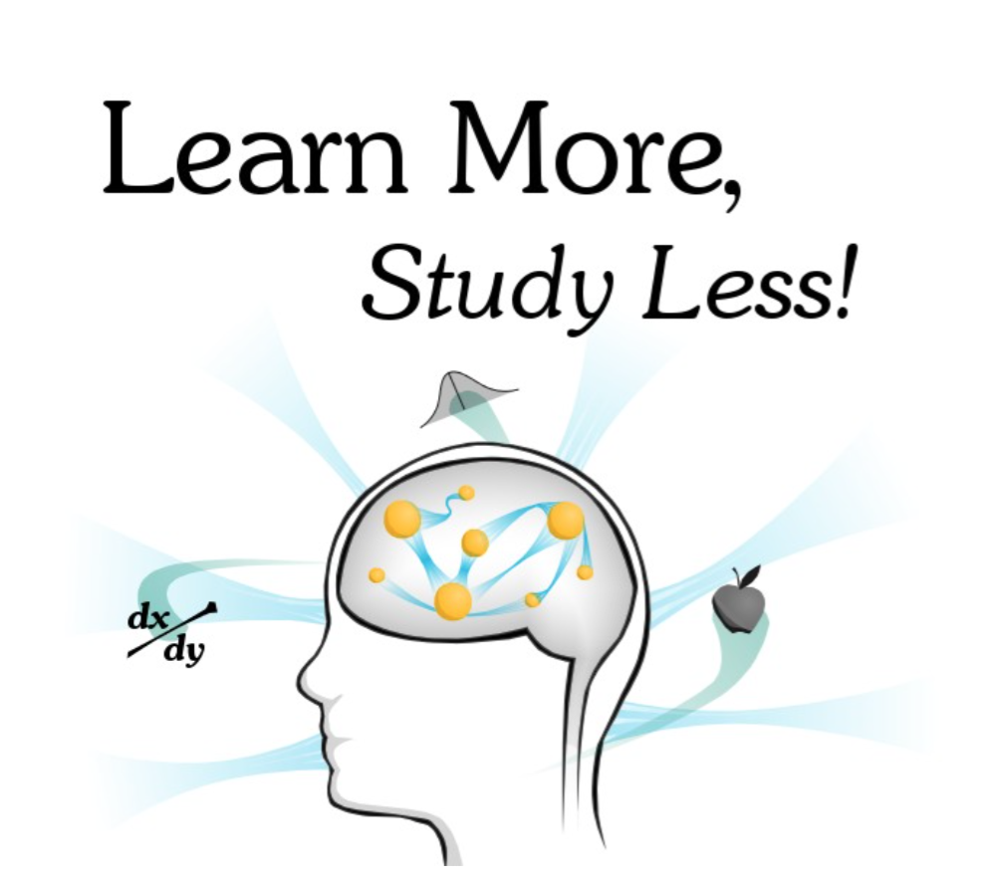

# Learn More Study Less

## Part I: The Holistic Learning Strategy 17

* Constructs
* Models
* Highways
* The Sequence of Holistic Learning 37
	* Acquire
	* Understand
	* Explore
	* Debug
	* Apply
	* Test
	* Pinpointing Your Weaknesses in the Sequence

* Information Structures 70

	* Arbitrary
	* Opinion
	* Process
	* Concrete
	* Abstract
	* How to Use the Five Categories

* Why Your Classes Are Boring
* Goals for Learning

## Part II: Holistic Learning Techniques 92

* Acquiring Information
	* Speed Reading
		* Active Reading
	* Flow-Based Notetaking
* Linking Ideas 114
	* Metaphor
	* Visceralization
	* Diagraming
		* Concept Diagrams
		* Flow Diagrams
		* Image Diagrams



* Handling the Arbitrary
	* The Link Method
		* Steps for Using the Link Method
		* Challenges With the Link Method
	* The Peg Method

	* Information Compression
		* Mnemonics
		* Picture Linking
		* Notes Compression



* Extending Ideas
	* Practical Usage
	* Model Debugging
	* Project-Based Learning
* Review of Holistic Learning Techniques




## Part III: Beyond Holistic Learning 185


* The Productive Student 186
	* Manage Your Energy
	* Don't “Study”
	* Nuke Procrastination
	* Batching
	* Be Organized

* Educate Yourself
	* Structuring Learning Habits
	* Overcoming the Frustration Barrier
	* Setting Learning Goals
	* Summary & Self-Education Resources
