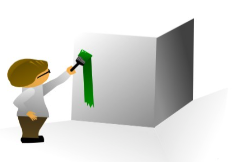

# The Sequence of Holistic Learning 37

Step    |   Is
-|-
1) Acquire | The point at which information enters through your eyes and ears. Reading, taking notes in a class or personal experiences are all part of the Acquire Phase. The goal here is to get accurate information in the most compressed form.
2) Understand | Understanding means taking raw information and giving it a context. This would be the most basic interlinking you would need to perform in order to learn.
3) Explore | The Explore Phase is really where holistic learning takes full force. Here you form the models, highways and broader connections needed for well defined constructs.
4) Debug | The Debug Phase looks for errors in your models and highways. This phase prunes back your connections so invalid ones won’t remain, or will be constrained to the area they work.
5) Apply | The Apply Phase takes debugging to the final level by making adjustments compared to how this information operates in reality. Having a set of understandings is useless if they aren’t tailored to the real world. Failure on this step could be an example of people who have book-smarts but can’t seem to use them outside the class.

## Acquire

```
The Acquire Phase can be enhanced by adopting better reading and listening methods.**
```

_Simplicity_
```
before = "I am. I am. I am. I am. I am. I am."
after = I'm x 6
```
_Volume_
> Someone who reads a 100 books a year will usually have more knowledge than someone who reads only 2 or 3.

_Speed_
> reading a book in thirty minutes is better than taking an hour.

## Understand

```
you are getting at the surface of information
```
> when you encounter a tricky subject is to break it into components. Narrow down specifically what you don't understand so you can use further reading to fill the gaps.

## Explore

```
Exploration is really the start of holistic learning.
You would also broaden your understanding of
    - not only how the information is derived,
    - but what it is related to.
```
Exploration |   is
-|
Depth   |   lock an idea in place
Lateral |   link models
Vertical    |   build highways between constructs

## Debug

```
Debugging can be seen as pruning back the holistic web.
```
- reading books from authors that oppose your points of view (and can point out errors in your reasoning)
- testing your information in the world and seeing where it doesn’t apply.

## Apply

```
- Someone who has read a library of business books may understand concepts,
- but someone who has run a business can feel them.
```
## Test

```
It requires a lot of self-awareness to better understand where you sit with any new idea you encounter.
```

level   |   use case
-|-
Acquire Test | Have I seen/listened to the idea before?
Understand Test | Do I get (at a surface level) what this idea means?
Explore Test | Do I understand where this idea comes from, what it is related to and what outside ideas can be connected with it?
Debug Test | Have I removed inappropriate links between this idea and others? Have I removed false conclusions based on connections that don’t actually exist?
Apply Test | Have I used this idea in my practical life?

> Pinpointing Your Weaknesses in the Sequence
