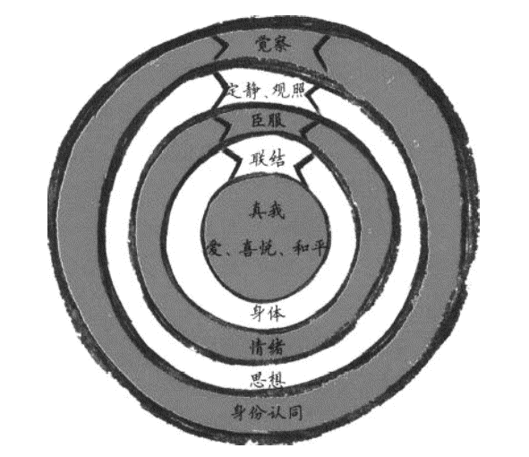

# cycle

diminishing return:

applies to 快乐
won’t apply to喜悦.

区分同理心 / 同情心

empathy |ˈɛmpəθi|nounthe ability to understand and share the feelings of another.
sympathy |ˈsɪmpəθi|noun (pl. sympathies)1 feelings of pity and sorrow for someone else's misfortune: they had great sympathy forthe flood victims.

给予：不轻给，不乱给，不吝给。
